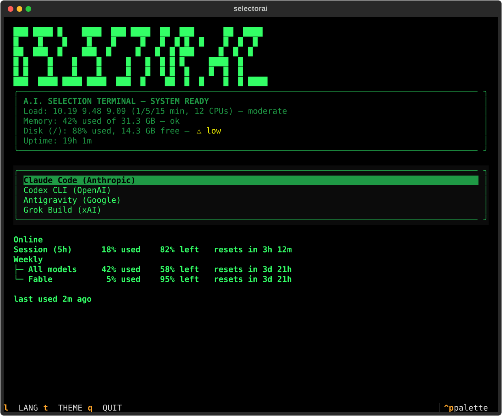

# selectorai

Rotate between your AI coding CLIs' free quotas from one retro terminal
picker — built for the start of an SSH session.

selectorai installs, updates, and picks between Claude Code, Codex CLI,
Antigravity, and Grok Build: shows quota and last-use for each, probes
whether the provider's own service is actually up, and launches whichever
one you pick with a fixed, predictable set of flags.



## Features

- **A full-screen picker**, not a numbered list — arrow keys, big
  block-letter title, boxed HUD-style panels. Providers are grouped into
  **online / warning / offline** sections instead of one flat list, so a
  quota-exhausted or service-down provider is visually out of the way
  without being hidden.
- **Quota countdowns**, not just reset dates — `resets in 2h 39m` next to
  the absolute time, for every bucket every provider exposes.
- **Service-status probes** — an independent check of each provider's own
  public status page, in parallel with the quota check, so a real outage
  shows even when your account quota looks fine.
- **Background tmux sessions + reattach** — launches persist through an
  SSH drop or a closed laptop lid, with a "reattach" offer and an output
  peek the next time you open the picker.
- **Guided setup** (`setup`) — a nine-step walkthrough (language,
  providers, auth, theme, and more) that only ever runs the real
  subcommands it's offering, never a separate implementation.
- **Clean-URL auth flows** — every provider's login goes through the same
  wrapper that reconstructs a copy-pastable single-line URL, even when
  your terminal line-wrapped it.
- **Three languages** (English, Español, Русский) and **three themes**,
  switchable live from inside the picker (`L`/`T`).

## Quick start

```bash
git clone <this-repo-url> selectorai
cd selectorai
./selectorai.py setup     # guided: language, install, auth, theme
./selectorai.py           # the picker
```

Requires Python 3 (stdlib only for everything except the picker itself,
which bootstraps its own isolated venv on first interactive run — see
[Config & state](#config--state-selectorai) below). `selectorai.sh` is a
dependency-free bash fallback for machines without Python (launch + quota
only, feature-frozen).

## What quota visibility each provider really has

| Provider | Quota check | Why |
|---|---|---|
| **Claude Code** | ✅ Live, always | The only CLI with a confirmed working non-interactive usage query (`claude -p "/usage"`) — no gating needed. |
| **Codex CLI** | ⚠️ Reactive only | No non-interactive usage command exists anywhere in `codex --help`/`doctor`/`login status` — quota is only known after you actually hit a rate limit through this script, from the error message it prints. |
| **Antigravity** | ✅ Live, opt-in | `agy -p "/usage"` works, but an unauthenticated call can pop a real Google OAuth browser window — gated behind `--check-antigravity` for that reason. |
| **Grok Build** | ✅ Live, opt-in | The "Usage limit" tab of grok's own `/info` popup has it, but only as an interactive TUI panel — no headless flag or JSON field exposes it. Gated behind `--check-antigravity`'s sibling flag, `--check-grok`, which opens a real `grok` session in a throwaway tmux window to read that panel. |

Full sourcing, confirmation steps, and the incidents behind each of these
is in [`docs/NOTES.md`](docs/NOTES.md#what-status-actually-means-per-provider).

## Commands

Every subcommand below is dispatched in `sai/cli.py`'s `main()` — cross-
checked against that code, not written from memory.

| Command | What it does |
|---|---|
| `./selectorai.py` | Interactive picker (or plain numbered menu without a real terminal). |
| `./selectorai.py "prompt text"` | Same, with an initial prompt passed to whichever provider you pick. |
| `./selectorai.py setup [--dry-run]` | Guided first-run walkthrough. `--dry-run` prints what each step would do, changes nothing. |
| `./selectorai.py install` (alias `update`) | Install what's missing, update what's already there, for every provider. |
| `./selectorai.py status [--who]` | Machine status + quota/reset info per provider. `--who` adds who else is logged in (opt-in). |
| `./selectorai.py auth [provider...]` | Log into every installed provider (or the ones named) with the clean-URL flow. |
| `./selectorai.py check-antigravity [on\|off]` | Show, or persist, whether Antigravity's live usage check runs by default. |
| `./selectorai.py check-grok [on\|off]` | Show, or persist, whether Grok's live usage check (tmux-driven) runs by default. |
| `./selectorai.py background [on\|off]` | Show, or persist, whether launches run inside a reattachable tmux session. |
| `./selectorai.py models [provider...]` | Refresh + print model listings for every installed provider (or the ones named). |
| `./selectorai.py theme [name]` | Show + pick, or set directly, the picker's visual theme. |
| `./selectorai.py lang [code]` | Show + pick, or set directly, the display language. |

Global flags, valid anywhere before or mixed into the above (parsed in
`sai/cli.py`'s `main()`, ahead of subcommand dispatch):

| Flag | Effect |
|---|---|
| `--refresh`, `-r`, `--no-cache` | Force a fresh network probe of quota, bypassing the short-term cache. |
| `--lang <code>` / `--lang=<code>` | One-off language override for this run only, not saved. |
| `--check-antigravity` | One-off: probe Antigravity's live usage for this run only, not saved. |
| `--check-grok` | One-off: probe Grok's live usage (tmux-driven) for this run only, not saved. |

Bare picker / prompt mode only — parsed inside `cmd_menu()`, so they only
take effect when `argv[0]` isn't one of the subcommands above (e.g.
`./selectorai.py --yolo` or `./selectorai.py -c "keep going"`; they are
inert on `status`, `auth`, `models`, etc.):

| Flag | Effect |
|---|---|
| `--yolo` | Full permission bypass instead of each provider's safer default (see [`docs/NOTES.md`](docs/NOTES.md#auto-mode-flags-per-provider)). |
| `--continue`, `-c` | Resume the chosen provider's most recent session instead of starting fresh. |

Flags compose and order doesn't matter: `./selectorai.py -c --yolo "keep going"`.

## Config & state (`~/.selectorai/`)

Everything mutable lives here, never in the repo — the repo is safe to
`git clean` at any time.

| File | Purpose |
|---|---|
| `lang` | Saved display language. |
| `theme` | Saved picker theme. |
| `cache.json` | Short-TTL quota/status cache + long-TTL model listings. |
| `check_antigravity` | Persisted opt-in toggle for Antigravity's live probe. |
| `background` | Persisted tmux-wrapping toggle (absent = on, once tmux is installed). |
| `launch.log` | Informational history of launches made through this script. |
| `venv/` | Isolated venv holding the picker's one real dependency, [Textual](https://textual.textualize.io/) — created on first interactive run, never touches system Python. |

## i18n, themes, background sessions, SSH context

- **Languages**: `i18n/{en,es,ru}.json`, flat key/value, identical key sets
  across all three. `L` cycles language live from inside the picker.
- **Themes**: `themes/*.tcss`, standalone Textual stylesheets — dropping a
  new file in makes it selectable with no code change. `T` cycles theme
  live from inside the picker.
- **Background sessions**: when `tmux` is installed, launches run inside a
  shared detached session so an SSH drop doesn't kill them — see
  [`docs/NOTES.md`](docs/NOTES.md#background-sessions-tmux--reattach-after-an-ssh-drop).
- **SSH context** (`status --who`): opt-in view of who else is connected,
  using only `SSH_CONNECTION`/`SSH_TTY`/`SSH_CLIENT` env vars — no tty
  ioctls, nothing that can trigger a permission prompt.

## Known limitations

Codex and Antigravity's rate-limit detection is inherently reactive, not
proactive; Antigravity's own session persistence is flaky upstream and can
re-prompt for login unpredictably; the tmux background-session feature is
built from documented conventions but not yet exercised against a real
tmux binary. Full detail, sourcing, and the incidents behind each of these
is in [`docs/NOTES.md`](docs/NOTES.md#known-limitations).

## Contributing

Start with [`docs/ARCHITECTURE.md`](docs/ARCHITECTURE.md) for the module
layout and the provider contract, then
[`docs/ADDING_PROVIDERS.md`](docs/ADDING_PROVIDERS.md) for a practical
walkthrough of adding a new one, including the safety lessons this project
already learned the hard way.

## Roadmap

Ranked near-term provider additions, a local-model integration plan, and
ideas borrowed (with credit) from adjacent projects: see
[`docs/ROADMAP.md`](docs/ROADMAP.md).

## License

MIT — see [`LICENSE`](LICENSE).
